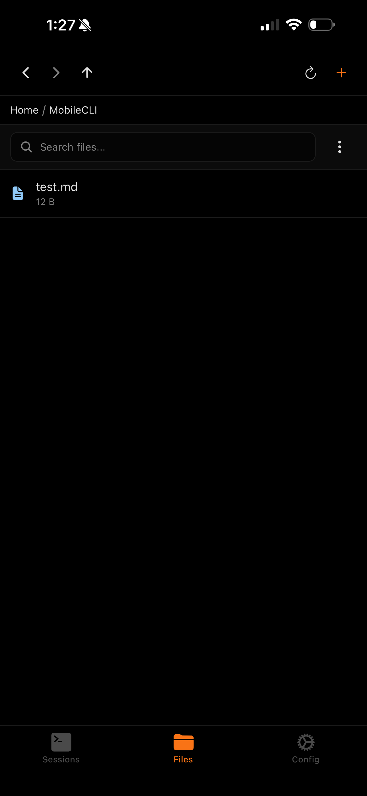
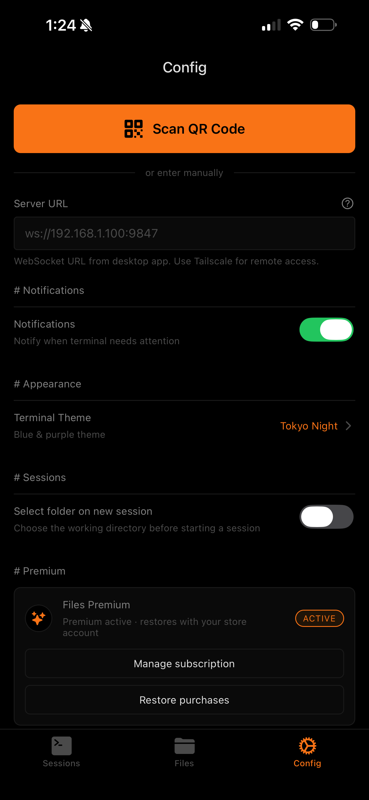

<div align="center">

# >_ MobileCLI

### Your desktop terminal, in your pocket.

Stream Claude Code, Codex, Gemini CLI, and any terminal session to your phone in real time.
Approve tool calls from the couch. Browse and edit files on your dev machine from anywhere.

[](https://github.com/MobileCLI/mobilecli)
[](LICENSE)
[](https://www.rust-lang.org/)
[]()
[](https://testflight.apple.com/join/MobileCLI)

[Website](https://mobilecli.app) · [Download CLI](https://github.com/MobileCLI/mobilecli/releases) · [iOS App](https://testflight.apple.com/join/MobileCLI)

</div>

<br/>

<div align="center">
<table>
<tr>
<td align="center"><br/><sub>Live Terminal</sub></td>
<td align="center"><br/><sub>Session Management</sub></td>
<td align="center"><br/><sub>Spawn from Phone</sub></td>
</tr>
<tr>
<td align="center"><br/><sub>Remote File Browser</sub></td>
<td align="center"><br/><sub>Code Editor</sub></td>
<td align="center"><br/><sub>Configuration</sub></td>
</tr>
</table>
</div>

<br/>

## Why MobileCLI exists

You kick off Claude Code on a large refactor. You go make coffee. You come back 20 minutes later and discover it's been blocked on a tool approval since minute two.

This happens constantly with AI coding assistants. They're powerful but need a human in the loop. That human doesn't need to be chained to a desk.

**MobileCLI streams your terminal to your phone over your local network.** When your AI assistant asks a question, requests tool access, or finishes a task, you get a push notification. Tap it, read the context, approve or deny, and go back to what you were doing.

No cloud. No accounts. No relay servers. Just a direct WebSocket between your machine and your phone.

<br/>

## Getting started

### 1. Install the daemon

```bash
curl -fsSL https://mobilecli.app/install.sh | bash
```

This downloads a single static binary and puts it on your PATH. The daemon is written in Rust — no runtime dependencies, no Docker, no Node.js.

<details>
<summary>Other install methods</summary>

```bash
# From crates.io
cargo install mobilecli

# From source
git clone https://github.com/MobileCLI/mobilecli.git
cd mobilecli/cli && cargo install --path .

# Pre-built binaries (Linux x86_64/aarch64, macOS x86_64/arm64)
# → https://github.com/MobileCLI/mobilecli/releases
```
</details>

### 2. Pair your phone

```bash
mobilecli setup
```

This starts the daemon, generates a cryptographic auth token, and displays a QR code. Open the MobileCLI iOS app, tap **Scan QR Code**, and you're connected. The QR encodes a `ws://` URL with your token — no manual entry needed.

### 3. Start a session

```bash
mobilecli claude                    # Claude Code
mobilecli codex                     # OpenAI Codex
mobilecli gemini                    # Gemini CLI
mobilecli -n "DB Migration" claude  # Named session
mobilecli bash                      # Plain shell
mobilecli                           # Your default $SHELL
```

Your phone now shows the terminal output in real time. Walk away.

<br/>

## How it works

MobileCLI has two components: a **Rust daemon** that runs on your dev machine, and a **React Native app** on your phone.

```
Your Machine                                     Your Phone
┌─────────────────────────────────┐              ┌───────────────────────────┐
│  mobilecli daemon (Rust)        │  WebSocket   │  MobileCLI App            │
│  ┌────────────────────────────┐ │◄────────────►│                           │
│  │ PTY Manager                │ │   LAN or     │  ┌─ Sessions tab          │
│  │  session 1: claude code    │ │   Tailscale  │  │   Live xterm.js        │
│  │  session 2: codex          │ │              │  │   Touch keyboard       │
│  │  session 3: bash           │ │              │  │   Push notifications   │
│  └────────────────────────────┘ │              │  │                         │
│  ┌────────────────────────────┐ │              │  ├─ Files tab (Pro)       │
│  │ File System Bridge         │ │              │  │   Browse, edit, search │
│  │  read / write / search     │ │              │  │   Create, delete, copy │
│  │  git status integration    │ │              │  │                         │
│  └────────────────────────────┘ │              │  └─ Config tab            │
│  ┌────────────────────────────┐ │              │     Theme, notifications  │
│  │ CLI Detection Engine       │ │              │     Connection settings   │
│  │  claude, codex, gemini,    │ │              │                           │
│  │  opencode — auto-detected  │ │              └───────────────────────────┘
│  └────────────────────────────┘ │
└─────────────────────────────────┘
          │
    Port 9847 (default)
    Auth token required
    Never leaves your network
```

The daemon allocates a PTY (pseudo-terminal) for each session, streams the byte output over WebSocket, and relays keyboard input from your phone back to the PTY. The mobile app renders the stream using a bundled xterm.js instance — full ANSI color, cursor positioning, and alternate screen buffer support.

<br/>

## Core features

### Multi-session management

Run multiple AI assistants simultaneously. The Sessions tab shows all active and historical sessions with live status indicators. Long-press to rename or close sessions. Tap the **+** button to spawn a new CLI directly from your phone — Claude Code, Codex, Gemini CLI, OpenCode, or a plain shell.

Sessions persist across daemon restarts. If you close the app and come back, your sessions are still there with full scrollback history.

### Smart CLI detection

The daemon automatically identifies which AI assistant is running in each session and parses its output to detect wait states — tool approval prompts, plan reviews, questions.

| CLI | Wait-state Detection | What Gets Detected |
|-----|---------------------|--------------------|
| **Claude Code** | ANSI output parsing | Tool calls, plan reviews, questions, completion |
| **OpenAI Codex** | Output pattern matching | Approval prompts, completion signals |
| **Gemini CLI** | Prompt detection | Yes/No prompts, input requests |
| **OpenCode** | TUI state parsing | Navigation prompts, approval dialogs |
| **Any command** | Generic | Full terminal with manual interaction |

When a wait state is detected, the daemon fires a push notification to your phone. You don't need to keep the app open or watch the session — you'll be alerted the moment your attention is needed.

### Real-time terminal

The terminal view is a full xterm.js 5.3 instance running inside a WebView:

- **256-color ANSI** rendering with correct cursor positioning
- **Scrollable history** — scroll up through output, auto-scroll follows new content at the bottom
- **Touch keyboard** with a toolbar providing Esc, arrow keys (for CLI history), paste, and file attachment buttons
- **Responsive resize** — terminal dimensions adapt to your phone/tablet screen and send the new size to the PTY so output reflows correctly
- **Low latency** — WebSocket streaming over LAN is typically sub-10ms

### File browser and editor *(Pro)*

The Files tab gives you direct access to your dev machine's filesystem:

- **Browse** directories with breadcrumb navigation, file sizes, and modification times
- **Search** files by name across your entire project tree
- **Edit** files with a built-in editor featuring Save/Undo/Redo, Markdown formatting shortcuts (Bold, Italic, Code, H1, List, Link), and syntax awareness
- **Create** new files and folders from your phone
- **Upload** photos, files, or camera captures from your phone to your dev machine — the daemon saves them and returns the desktop path so you can paste it into your terminal
- **Git integration** — file listings show git status indicators

### Push notifications

Notifications are delivered through APNs (Apple Push Notification service). The daemon sends a push when:

- An AI CLI enters a wait state (tool approval, plan review, question)
- A session finishes or exits
- A long-running command completes

The push token is registered over the WebSocket connection — no external services, no Firebase, no accounts. The daemon talks directly to APNs using your device token.

<br/>

## Privacy and security

MobileCLI is **fully self-hosted**. There is no cloud component.

- **No relay servers.** Your terminal output travels directly from your machine to your phone over your local network.
- **No accounts.** No sign-up, no email, no OAuth.
- **No telemetry.** The daemon collects nothing.
- **Auth token.** Every WebSocket connection requires a cryptographic token generated during `mobilecli setup`. The token is stored in iOS Keychain and `~/.mobilecli/config.json`.
- **Token stripping.** Auth tokens are scrubbed from session output before streaming, preventing accidental exposure.
- **Bounded resources.** The daemon limits concurrent connections, channel buffer sizes, and session counts to prevent resource exhaustion.

Your terminal output **never touches the internet** unless you explicitly configure Tailscale or a custom URL for remote access.

<br/>

## Connection modes

| Mode | How it works | Setup |
|------|-------------|-------|
| **LAN** | Direct WebSocket over your WiFi/ethernet. Fastest and simplest. | Auto-detected during `mobilecli setup` |
| **Tailscale** | WireGuard mesh VPN. Access from anywhere, still peer-to-peer. | `mobilecli setup` → select your Tailscale IP |
| **Custom URL** | Your own proxy, port-forward, or TLS terminator. | Provide a `ws://` or `wss://` URL |

For most users, LAN mode is all you need. Open a terminal, scan the QR, done.

<br/>

## CLI reference

```
mobilecli [OPTIONS] [COMMAND]

Session commands:
  mobilecli                           Start default shell with streaming
  mobilecli <command>                 Run any command with streaming
  mobilecli -n "Name" <command>       Name the session for easy identification
  mobilecli link [session-id]         Attach to an existing session (tmux-like)

Setup and management:
  mobilecli setup                     Interactive setup wizard (generates QR code)
  mobilecli pair                      Show QR code for pairing additional devices
  mobilecli status                    Show daemon status, active sessions, connections
  mobilecli stop                      Stop the daemon

Daemon lifecycle:
  mobilecli daemon [--port PORT]      Start daemon manually (default port: 9847)
  mobilecli autostart install         Auto-start daemon on login
  mobilecli autostart uninstall       Remove auto-start
  mobilecli autostart status          Check auto-start status

Shell integration:
  mobilecli shell-hook install        Auto-launch mobilecli in every new terminal
  mobilecli shell-hook uninstall      Remove the shell hook
  mobilecli shell-hook status         Check shell hook status
```

### Daemon autostart

The daemon can register itself to start automatically when you log in:

| Platform | Mechanism | Command |
|----------|-----------|---------|
| **Linux** | systemd user service | `mobilecli autostart install` |
| **macOS** | launchd agent | `mobilecli autostart install` |
| **Windows** | Task Scheduler | `mobilecli autostart install` |

### Shell hook

To automatically wrap every new terminal session:

```bash
mobilecli shell-hook install
```

This adds a one-liner to your `.bashrc`, `.zshrc`, `config.fish`, or PowerShell `$PROFILE`. Every new shell you open will be streamed to your phone automatically. Bypass it temporarily:

```bash
MOBILECLI_NO_AUTO_LAUNCH=1 bash
```

<br/>

## Platform support

### CLI daemon

| Platform | Architecture | Status |
|----------|-------------|--------|
| **Linux** | x86_64, aarch64 | Fully supported |
| **macOS** | Intel, Apple Silicon | Fully supported |
| **Windows** | x86_64 | Fully supported |

### Mobile app

| Platform | Status |
|----------|--------|
| **iOS** (iPhone + iPad) | Available on TestFlight — [Join Beta](https://testflight.apple.com/join/MobileCLI) |
| **Android** | In development |

<br/>

## Pricing

The CLI daemon is **open source and free forever** (MIT license).

The mobile app has a free tier and an optional Pro upgrade:

| | Free | Pro |
|---|---|---|
| Live terminal streaming | Unlimited sessions | Unlimited sessions |
| Push notifications | Included | Included |
| Multi-session management | Included | Included |
| Spawn sessions from phone | Included | Included |
| Rename / close sessions | Included | Included |
| Multiple themes | Included | Included |
| File browser & editor | — | Included |
| Full-text file search | — | Included |
| Photo / file upload to desktop | — | Included |
| | **Free** | **$19.99/yr** or **$29.99 lifetime** |

<br/>

## Configuration

All config lives in `~/.mobilecli/`:

| File | Purpose |
|------|---------|
| `config.json` | Device identity, connection URL, auth token hash |
| `sessions.json` | Persisted session metadata (names, history) |
| `daemon.pid` | Running daemon's process ID |
| `daemon.port` | Active WebSocket port (default: `9847`) |
| `daemon.log` | Debug log output |

<br/>

## Development

### CLI (Rust)

```bash
cd cli
cargo build                     # Debug build
cargo run -- setup              # Run setup wizard
RUST_LOG=debug cargo run        # Verbose logging
cargo test                      # Run tests
cargo clippy                    # Lint
```

The daemon is ~7,000 lines of async Rust built on `tokio`. Key modules:

| Module | Lines | Role |
|--------|-------|------|
| `daemon.rs` | 2,700 | WebSocket server, session lifecycle, file system bridge |
| `protocol.rs` | 550 | All client/server message types (serde JSON) |
| `shell_hook.rs` | 530 | Cross-platform shell integration (bash/zsh/fish/PowerShell) |
| `autostart.rs` | 560 | systemd / launchd / Task Scheduler registration |
| `pty_wrapper.rs` | 490 | PTY allocation, I/O streaming, signal handling |
| `detection.rs` | 390 | AI CLI fingerprinting and wait-state parsing |
| `setup.rs` | 570 | Interactive wizard, QR generation, network detection |
| `main.rs` | 450 | CLI argument parsing and command dispatch |

### Mobile app (React Native / Expo)

The mobile app is in a [separate repository](https://github.com/MobileCLI/mobile):

```bash
cd mobile
npm install
npx expo start                  # Dev server (press 'i' for iOS simulator)
npx eas-cli build --platform ios --profile production  # Production build
```

Key technologies: Expo Router (navigation), xterm.js 5.3 (terminal rendering in WebView), expo-secure-store (credential storage), RevenueCat (subscriptions).

### Project layout

```
MobileCLI/
├── cli/                        # Rust daemon + CLI wrapper
│   └── src/
│       ├── main.rs             # Entry point, clap argument parsing
│       ├── daemon.rs           # WebSocket server, PTY management, filesystem ops
│       ├── protocol.rs         # Client ↔ Server message types
│       ├── pty_wrapper.rs      # PTY spawning and byte-level I/O
│       ├── detection.rs        # AI CLI detection + wait-state parsing
│       ├── setup.rs            # Interactive setup wizard + QR code
│       ├── shell_hook.rs       # Shell auto-launch integration
│       ├── autostart.rs        # OS-level daemon autostart
│       ├── link.rs             # Session attachment (tmux-style)
│       ├── session.rs          # Session metadata structures
│       ├── platform.rs         # Cross-platform utilities
│       └── qr.rs               # QR code rendering
├── mobile/                     # React Native app (separate git repo)
├── website/                    # Marketing site (Astro + Tailwind)
├── install.sh                  # One-line installer script
├── .github/workflows/          # CI, release packaging, Claude Code review
└── docs/                       # Architecture docs + screenshots
```

<br/>

## Troubleshooting

<details>
<summary><b>Can't connect from mobile app</b></summary>

1. **Same network?** Your phone and machine must be on the same WiFi/LAN, or both on Tailscale.
2. **Daemon running?** Run `mobilecli status` to check. If not running, `mobilecli daemon` starts it.
3. **Firewall?** Ensure port `9847` (or whatever `~/.mobilecli/daemon.port` says) allows inbound TCP.
4. **Re-pair:** Run `mobilecli pair` to show a fresh QR code and scan it again.
5. **Check logs:** `~/.mobilecli/daemon.log` will show connection attempts and auth failures.
</details>

<details>
<summary><b>No push notifications</b></summary>

1. Verify notifications are enabled for MobileCLI in iOS Settings.
2. The push token registers automatically when the WebSocket connects — check the Config tab shows "connected" status.
3. Notifications require the daemon to be running. If you restart your machine, make sure the daemon is back up (`mobilecli autostart install` handles this automatically).
</details>

<details>
<summary><b>Terminal display issues</b></summary>

1. MobileCLI uses xterm.js with full ANSI 256-color support. Ensure your CLI sets `TERM=xterm-256color` (this is the default).
2. The terminal auto-resizes to fit your phone screen. TUI applications (like `htop` or `vim`) should adapt automatically.
3. If a session looks garbled after switching tabs, tap the session to re-enter it — the terminal refits on activation.
</details>

<details>
<summary><b>Session not appearing on phone</b></summary>

1. Sessions only appear when the daemon is running and your phone is connected.
2. Check `mobilecli status` to see active sessions and connected clients.
3. If you started a command without `mobilecli` wrapping it, it won't appear. Use `mobilecli <command>` or install the shell hook.
</details>

<br/>

## Contributing

Contributions are welcome. The CLI daemon is open source under the MIT license.

```bash
# Fork, clone, and create a feature branch
git clone https://github.com/YOUR_USERNAME/mobilecli.git
cd mobilecli/cli

# Build and test
cargo build
cargo test
cargo clippy -- -D warnings

# Open a PR against main
```

Claude Code review is enabled on this repository — your PR will receive automated feedback.

<br/>

## License

MIT — see [LICENSE](LICENSE) for details.

<br/>

<div align="center">

---

**Stop babysitting your AI assistant.** Start it, walk away, and get a push when it needs you.

[Get the CLI](https://mobilecli.app) · [Join the iOS Beta](https://testflight.apple.com/join/MobileCLI) · [GitHub](https://github.com/MobileCLI/mobilecli)

</div>
