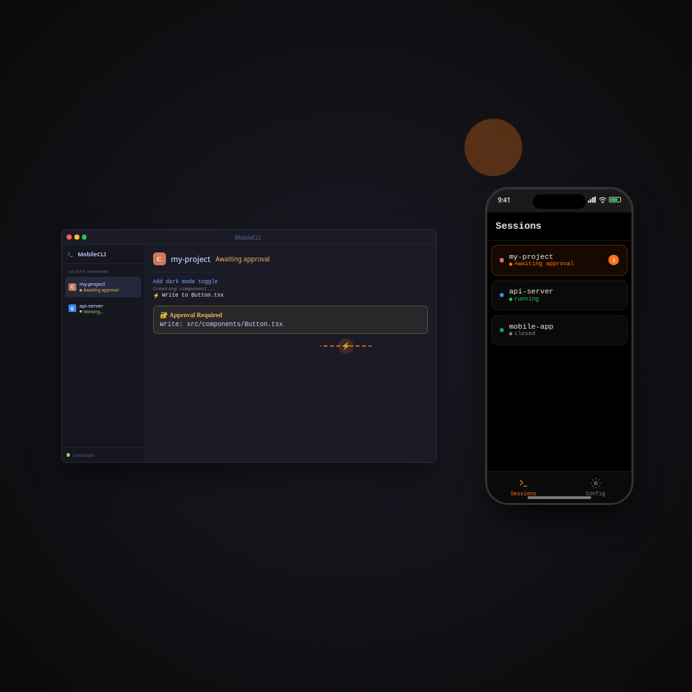
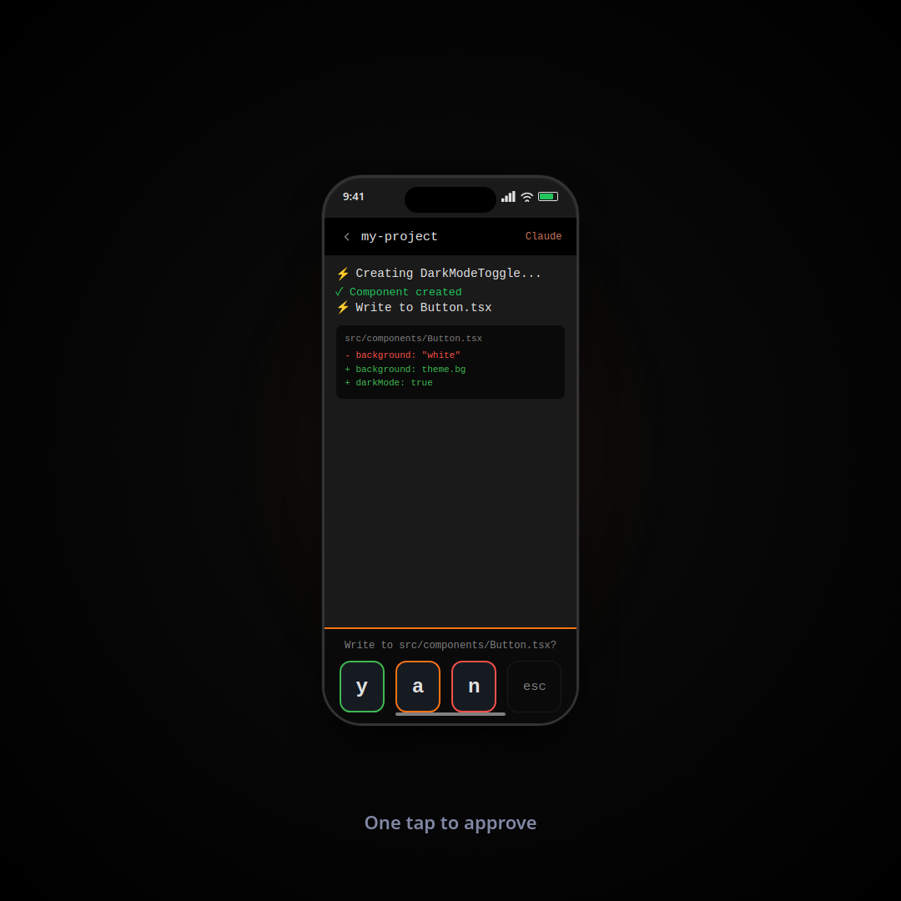

<div align="center">

# >_ MobileCLI

### Your AI coding assistant, untethered.

Stream Claude Code, Codex, Gemini CLI, and any terminal to your phone.\
Approve tool calls, browse files, and ship code — from anywhere.

[](https://github.com/MobileCLI/mobilecli)
[](LICENSE)
[](https://www.rust-lang.org/)
[]()
[](https://testflight.apple.com/join/MobileCLI)

[Website](https://mobilecli.app) &bull; [Download](https://github.com/MobileCLI/mobilecli/releases) &bull; [Docs](https://mobilecli.app/docs) &bull; [TestFlight](https://testflight.apple.com/join/MobileCLI)

<br/>



</div>

<br/>

## The Problem

AI coding assistants run long tasks that need periodic human approval. You start Claude Code on a refactor, walk away, and come back 20 minutes later to find it's been waiting for you since minute two.

**MobileCLI fixes this.** Your terminal streams to your phone in real time. When your AI assistant needs you, you get a push notification and approve with one tap.

<br/>

<div align="center">

<br/>
<sub><b>One tap to approve, deny, or always-allow.</b></sub>
</div>

<br/>

## Quick Start

### 1. Install the CLI

```bash
curl -fsSL https://mobilecli.app/install.sh | bash
```

<details>
<summary>Other install methods</summary>

```bash
# From crates.io
cargo install mobilecli

# From source
git clone https://github.com/MobileCLI/mobilecli.git
cd mobilecli/cli && cargo install --path .

# Pre-built binaries
# → https://github.com/MobileCLI/mobilecli/releases
```
</details>

### 2. Pair your phone

```bash
mobilecli setup
```

Scan the QR code with the MobileCLI app. Done.

### 3. Stream

```bash
mobilecli claude           # Stream Claude Code
mobilecli codex            # Stream Codex
mobilecli -n "Refactor" claude   # Name your session
mobilecli                  # Stream your default shell
```

Your phone now mirrors your terminal. Walk away.

<br/>

## Features

### Smart CLI Detection

MobileCLI automatically detects which AI assistant you're running and adapts the approval UI:

| Assistant | Detection | Approval Style |
|-----------|-----------|---------------|
| **Claude Code** | Auto | Numbered options (y / a / n) |
| **Codex** | Auto | Numbered options |
| **Gemini CLI** | Auto | Yes / No prompts |
| **OpenCode** | Auto | Arrow key navigation |
| Any command | Manual | Full terminal + keyboard |

### Push Notifications

Get notified the moment your CLI needs you — not 20 minutes later.

- Tool approval requests
- Plan review prompts
- Questions requiring your input
- Session completion alerts

### File Browser & Editor *(Pro)*

Browse, search, edit, and manage files on your dev machine from your phone:

- Syntax-highlighted code editor
- Full-text search across directories
- Create, rename, copy, and delete files
- Markdown preview, image viewer, PDF viewer
- Upload files from your phone to your dev machine

### Real-time Terminal

- Full ANSI color and formatting (256-color)
- Scrollable output history
- Touch keyboard with special keys (Ctrl, Tab, arrows, Esc)
- Responsive resize for mobile screens
- Low-latency WebSocket streaming

<br/>

## Privacy-First Architecture

MobileCLI is **100% self-hosted**. No cloud relay. No third-party servers. No accounts.

```
Your Machine                            Your Phone
┌──────────────────────┐   WebSocket   ┌──────────────────────┐
│                      │◄────────────►│                      │
│   mobilecli daemon   │  LAN / VPN   │   MobileCLI App      │
│   (Rust, port 9847)  │              │   (React Native)     │
│                      │              │                      │
│   ┌──────────────┐   │              │   - Live terminal    │
│   │ PTY session  │   │              │   - Push notifs      │
│   │ claude/codex │   │              │   - File browser     │
│   │ gemini/etc   │   │              │   - One-tap approve  │
│   └──────────────┘   │              │                      │
└──────────────────────┘              └──────────────────────┘
         │
   Direct connection
   over your network
   (never leaves LAN)
```

Your terminal output **never touches the internet** unless you explicitly use Tailscale for remote access.

<br/>

## Connection Modes

| Mode | Use Case | Setup |
|------|----------|-------|
| **Local Network** | Same WiFi / LAN | Zero config — auto-detected |
| **Tailscale** | Access from anywhere | `mobilecli setup` → choose Tailscale |
| **Custom URL** | TLS proxy, port forwarding | Provide your own `ws://` or `wss://` URL |

<br/>

## CLI Reference

```
USAGE:
    mobilecli [OPTIONS] [COMMAND]

COMMANDS:
    mobilecli                         Start your shell with streaming
    mobilecli <command>               Run a command with streaming
    mobilecli -n "Name" <cmd>         Name the session
    mobilecli setup                   Run setup wizard + show QR code
    mobilecli status                  Show daemon and session info
    mobilecli pair                    Show QR code for pairing
    mobilecli link [session]          Attach to an existing session
    mobilecli daemon [--port PORT]    Start daemon manually
    mobilecli stop                    Stop the daemon
    mobilecli autostart install       Auto-start daemon on login (systemd/launchd/Task Scheduler)
    mobilecli autostart uninstall     Remove auto-start
    mobilecli shell-hook install      Auto-launch mobilecli in new terminals
    mobilecli shell-hook uninstall    Remove auto-launch hook
    mobilecli shell-hook status       Check auto-launch status
```

### Auto-Launch

Want mobilecli to start every time you open a terminal?

```bash
mobilecli shell-hook install
```

This adds a small hook to your shell config (`.bashrc`, `.zshrc`, `config.fish`, or PowerShell `$PROFILE`). Remove it anytime with `mobilecli shell-hook uninstall`, or bypass temporarily:

```bash
export MOBILECLI_NO_AUTO_LAUNCH=1
```

<br/>

## Platform Support

### CLI (Daemon + Wrapper)

| Platform | Status | Daemon Autostart | Shell Hook |
|----------|--------|-----------------|------------|
| **Linux** | Fully supported | systemd user service | bash, zsh, fish |
| **macOS** | Fully supported | launchd agent | bash, zsh, fish |
| **Windows** | Fully supported | Task Scheduler task | PowerShell, cmd.exe |

### Mobile App

| Platform | Status | Link |
|----------|--------|------|
| **iOS** | TestFlight Beta | [Join Beta](https://testflight.apple.com/join/MobileCLI) |
| **Android** | Coming Soon | — |

<br/>

## Configuration

Config lives in `~/.mobilecli/`:

| File | Purpose |
|------|---------|
| `config.json` | Device identity, connection mode, auth token |
| `daemon.pid` | Running daemon process ID |
| `daemon.port` | WebSocket port (default: `9847`) |
| `daemon.log` | Daemon debug logs |

<br/>

## Pricing

The CLI daemon is **open source and free forever**.

| | Free | Pro |
|---|---|---|
| Terminal streaming | Unlimited | Unlimited |
| Push notifications | Included | Included |
| Tool call approvals | Included | Included |
| Session management | Included | Included |
| Multi-device | Included | Included |
| File browser & editor | — | Included |
| Code search | — | Included |
| Image / PDF / Markdown viewer | — | Included |
| | **$0** | **$20/yr** or **$30 lifetime** |
| | | 3-day free trial |

<br/>

## Development

### CLI (Rust)

```bash
cd cli
cargo build
cargo run -- setup          # Run setup wizard
RUST_LOG=debug cargo run    # Debug mode
cargo test                  # Run tests
cargo clippy                # Lint
```

### Mobile App (React Native / Expo)

```bash
cd mobile
npm install
npx expo start              # Development server
# Press 'i' for iOS simulator, 'a' for Android emulator
```

### Project Structure

```
MobileCLI/
├── cli/                        # Rust CLI daemon + wrapper
│   └── src/
│       ├── main.rs             # Entry point, command routing
│       ├── daemon.rs           # WebSocket server, session management
│       ├── pty_wrapper.rs      # PTY spawning, I/O streaming
│       ├── detection.rs        # AI CLI detection, wait-state parsing
│       ├── setup.rs            # Interactive setup wizard
│       ├── shell_hook.rs       # Shell auto-launch hook
│       ├── autostart.rs        # systemd / launchd / Task Scheduler integration
│       ├── filesystem/         # Remote file operations
│       └── protocol.rs         # WebSocket message types
├── mobile/                     # React Native app (Expo)
│   ├── app/                    # Expo Router screens
│   ├── components/             # Terminal, file browser, viewers
│   └── hooks/                  # useSync, useFileSystem, usePremium
├── website/                    # Marketing site (Astro + Tailwind)
├── install.sh                  # One-line installer
└── docs/                       # Documentation + architecture
```

<br/>

## Troubleshooting

<details>
<summary><b>Can't connect from mobile app</b></summary>

1. **Same network?** Phone and computer must be on the same WiFi (or both on Tailscale)
2. **Firewall?** Allow inbound on port `9847` (check `~/.mobilecli/daemon.port` for actual port)
3. **Daemon running?** Run `mobilecli status` to verify
4. **Re-pair:** Run `mobilecli pair` and scan the QR code again
</details>

<details>
<summary><b>No push notifications</b></summary>

1. Check notification permissions in iOS/Android settings
2. Push token registers automatically on WebSocket connect
3. Check `~/.mobilecli/daemon.log` for delivery errors
</details>

<details>
<summary><b>Terminal looks wrong on mobile</b></summary>

1. MobileCLI supports full ANSI 256-color — ensure your `TERM` is set (default: `xterm-256color`)
2. Terminal auto-resizes to phone screen; some wide content may wrap
3. Try landscape mode for wider output
</details>

<br/>

## Contributing

Contributions welcome. The CLI daemon is open source under MIT.

1. Fork the repo
2. Create a feature branch
3. Run `cargo test && cargo clippy` before submitting
4. Open a PR

<br/>

## License

MIT License — see [LICENSE](LICENSE) for details.

<br/>

<div align="center">

---

**Stop babysitting your AI assistant.** Let it work. You'll get a notification.

[Get Started](https://mobilecli.app) &bull; [GitHub](https://github.com/MobileCLI/mobilecli) &bull; [TestFlight](https://testflight.apple.com/join/MobileCLI)

</div>
